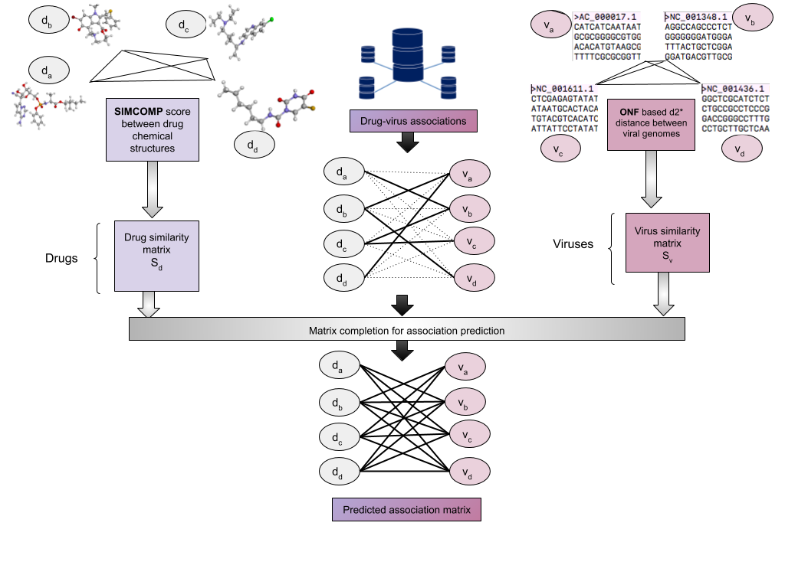

# DVA
**Computational methods for drug re-positioning identify potential anti-virals treatments against COVID-19**

Aanchal Mongia, Emilie Chouzenoux, Angshul Majumdar

This repository (DVA) has:
*  DVA (Drug virus association database)
* Collection of matrix completion based computational technqiues to predict anti-viral drug prediction for viruses

The raw data can be foundat: `./data_raw/database.xlsx`. The processed data has been created using the notebook `read_database.ipynb`. A schemetic view of the DVA database curation and association prediction using it has been shown below.

.

The computational algorithms used to predict drug-virus association are available in: `helper_functions/alg_template`

The results in the paper above can be reproduced by the follwing MATLAB scripts:

* `run.m`
* `./Experiments/novel_drugs_prediction.m`
* `./Experiments/coronavirus_pred.m`
